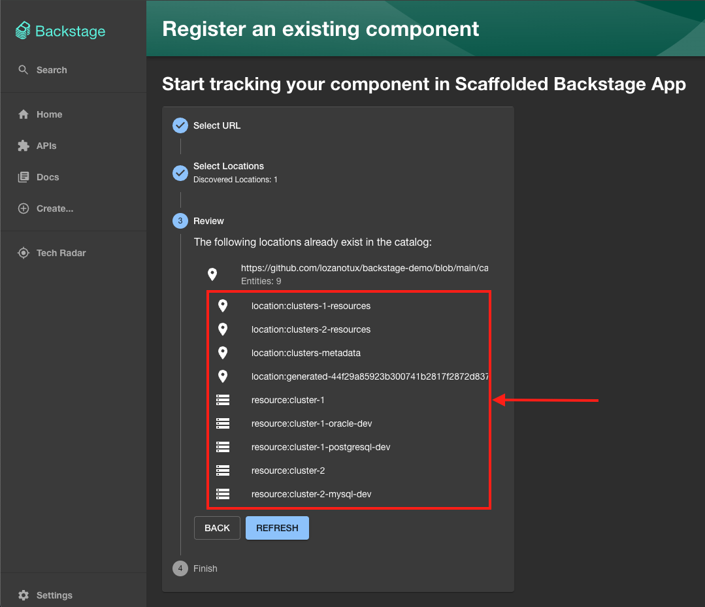
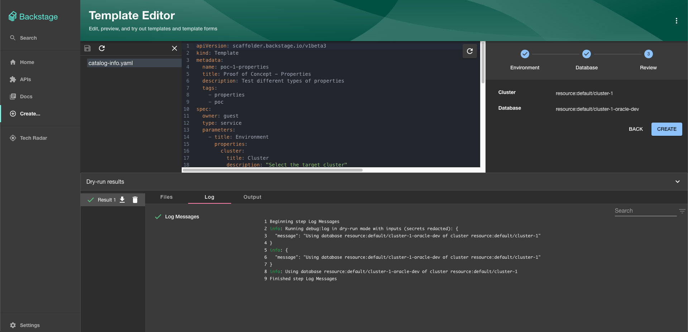

# Backstage Demo

Demo to test Backstage

## Create Standalone Backstage

**Prerequisites:**
* Latest [Active Node.js LTS](https://nodejs.org/en/about/previous-releases)
* [yarn](https://classic.yarnpkg.com/en/docs/install)
* [Docker](https://docs.docker.com/engine/install/)
* [Git](https://github.com/git-guides/install-git)
* curl or wget

If you want to create a standalone Backstage locally on your machine, run next commands:

1. Create backstage Node.js app:

    ```bash
    npx @backstage/create-app
    ```

2. Configure Github Access Token:

   - Generate a new Personal Access Token in your github account.

   - Edit the file `app-config.yaml` of your Backstage and configure the property `integrations.github.token`.

3. Run app:

    ```bash
    cd backstage
    ```

    ```bash
    yarn dev
    ```
    >**NOTE:** if you are using Node.js 20, maybe you have consider tu set environment variable `NODE_OPTIONS=--no-node-snapshot` before yarn command.

## Register New Components & Resources

If you want to register new components and resources from this repository, follow next steps:

1. From the web [console of Backstage](http://localhost:3000/), navigate to **Create** → **REGISTER EXISTING COMPONENT** and use next URL: `https://github.com/lozanotux/backstage-demo/blob/main/catalog-info.yaml`

2. Click **ANALYZE** button and verify the list of components to be registered:
    

## Test Templates

If you want to execute templates (to test properties, etc). Follow next steps: 

1. From the web [console of Backstage](http://localhost:3000/), navigate to **Create** → **⋮** (top right) → **Template Editor** → **Load Template Directory**

2. Select this repository/folder and confirm it clicking on **Accept/OK** button:
    

## Useful References

To see more information, please visit:

- **YAML Objects Specification:** [https://backstage.io/docs/features/software-catalog/descriptor-format](https://backstage.io/docs/features/software-catalog/descriptor-format)

- **Nunjucks Templating:** [https://mozilla.github.io/nunjucks/templating.html](https://mozilla.github.io/nunjucks/templating.html)